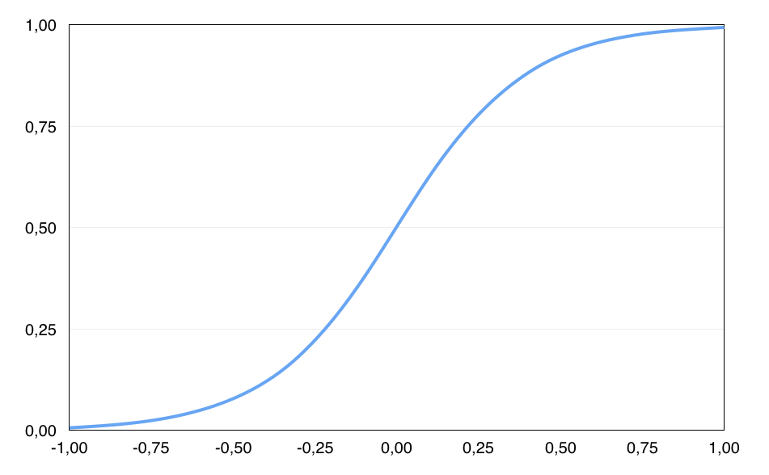

```{r setup, include=FALSE}
knitr::opts_chunk$set(echo = TRUE)
```



## ¿Qué es una regresión logística?

Una regresión logística se utiliza típicamente cuando hay una **variable de resultado dicotómica** (definida en dos valores, como ganar o perder, falso o verdadero), y una **variable predictiva continua** que está relacionada con la probabilidad de que ocurra un evento según factores relevantes.La regresión logística permite además calcular **la probabilida**d de que la variable dependiente pertenezca a cada una de las dos categorías en función del valor que adquiera la variable independiente.

Está modelada por la siguiente formula:


Se puede asimilar facilmente a una regresión lineal, simplemente que en la regresión lineal se busca predecir mediante la **creación de una recta generalizada**, pero en la regresión logística se tienen **resultados finales comprendidos entre dos estados concretos**.

### ¿En qué casos resulta útil utilizarlo?

Tomemos un ejemplo, cuando un banco recibe una solicitud de préstamo, se basa en su perfil *demográfico y socioeconómico* para tomar la decisión, si **realiza el prestamo** ó si **niega la solicitud de prestamo.** Aquí se encuentras dos casos de riesgo:

* Si es **muy probable** que la persona pague su crédito, negarle el prestamo es una **perdida de beneficios para el banco**
* Si es **poco probable** que la persona pague su crédito, concederle el prestamo es una **perdida financiera**

El objetivo de este tipo de análisis es **minimizar el riesgo y maximizar el beneficio** del banco.

## R y las regresiones logísticas

Claramente, R, siendo un entorno de programación enfocado en el análisis estadístico, cuenta con **soporte nativo y externo** para realizar regresiones de este estilo, algunas de las **librerias más conocidas** para esta funcionalidad son las siguientes:

| Título            | Paquete     | Autores       | Versión      |
|-------------------|-------------|---------------|--------------|
| The R stats package   | stats    | Equipo de R y contribuidores          | 5.0         |
| Companion to Applied Regression   | car    | John Fox, Sanford Weisberg, y otros         | 1.5         |
| Support Functions and Datasets for Venables and Ripley's MASS   | MASS    | Brian Ripley, Bill Venables, y otros         | 3.47         |
| Classification and Regression Training   | caret    | Max Kuhn y otros         | 0.77         |
| Lasso and Elastic-Net Regularized Generalized Linear Models   | glmnet    | Jerome Friedman, Trevor Hastie, Noah Simon, Junyang Qian, and Rob Tibshirani        | 0.13         |
| Stochastic Gradient Descent for Scalable Estimation   | sgd    | Stochastic Gradient Descent for Scalable Estimation        | 1         |
| Bayesian Linear Regression   | BLR    | Gustavo de los Campos, Paulino Perez Rodriguez        | 4         |
| Least Angle Regression, Lasso and Forward Stagewise   | Lars    | Trevor Hastie and Brad Efron        | 2         |

La más estable y recomendada para análisis estadísticos con regresiones logísticas es la nativa de R, **stats**, la cual cuenta con las siguentes funciones:

* **lm:** Esta función se utiliza para ajustar modelos lineales. Se puede utilizar para realizar regresiones, análisis de varianza de un solo estrato y análisis de covarianza.
* **summary.lm:** Esta función devuelve un resumen de los ajustes del modelo lineal.
* **coef:** Con la ayuda de esta función, se pueden extraer los coeficientes de los objetos devueltos por las funciones de modelado. Coefficients es un alias para ello.
* **fitted:** Esta función extrae los valores ajustados de los objetos devueltos por las funciones de modelado ajustadas. Los valores son un alias para ello.
* **formula:** Esta función proporciona una forma de extraer fórmulas que se han incluido en otros objetos.
* **predict:** Esta función predice valores basados ​​en objetos de modelo lineal.
* **residuals:** Esta función extrae los residuos del modelo de los objetos devueltos por las funciones de modelado.
* **confint:** Esta función calcula los intervalos de confianza para uno o más parámetros en un modelo ajustado. Base tiene un método para los objetos que heredan de la  lm clase.
deviance: Esta función devuelve la desviación de un objeto de modelo ajustado.
* **influence.measures:** Este conjunto de funciones se pueden utilizar para calcular algunos de la regresión (licencia-un-out supresión) de diagnóstico para linealy modelos lineales generalizados ( GLM ).
* **lm.influence:** Esta función proporciona las cantidades básicas que se utilizan al formar una amplia variedad de diagnósticos para comprobar la calidad de los ajustes de regresión.
* **ls.diag:** Esta función calcula estadísticas básicas, incluidos errores estándar, valores t y valores p para los coeficientes de regresión.
* **glm:** Esta función se utiliza para ajustar GLM, especificados dando una descripción simbólica del predictor lineal y una descripción de la distribución de errores.
* **loess:** Esta función se ajusta a una superficie polinomial determinada por uno o más predictores numéricos, utilizando un ajuste local.
* **loess.control:** Esta función establece parámetros de control para loessajustes.
* **predict.loess:** Esta función extrae predicciones de un loessajuste, opcionalmente con errores estándar.
* **scatter.smooth:** Esta función traza y agrega una curva suave calculada por loessa un gráfico de dispersión.

## Creando un modelo de regresión logística

A modo de ejemplo, se creará un modelo para predecir **la probabilidad de que no se pague una deuda** teniendo en cuenta **el balance de la cuenta bancaria** de un cliente.

## Aplicación del modelo de regresión logística

El conjunto de datos a usar se encuentra en ISLR, un paquete de aprendizaje, este brinda un conjunto de datos simulados que contiene información 10.000 clientes. Con un análisis mediante una regresión logística se puede predecir que clientes no pagaran su cuota El objetivo aquí es predecir qué clientes incumplirán con la deuda de su tarjeta de crédito.

```{r}
# Importar paquetes principales
library(tidyverse)
library(ISLR)

 #Definir los datos dummy provenientes de ISLR
notPayProbability = Default

#Definir los valores binarios para este caso
notPayProbability = notPayProbability %>%
         select(default, balance) %>%
         mutate(default = recode(default,
                                 "No"  = 0,
                                 "Yes" = 1))
head(notPayProbability)

# Crear un modelo lineal con los mínimos cuadrados
modelo_lineal = lm(default ~ balance, data = notPayProbability)

# Crear una representación gráfica del modelo lineal
ggplot(data = notPayProbability, aes(x = balance, y = default)) +
  geom_point(aes(color = as.factor(default)), shape = 1) + 
  geom_smooth(method = "lm", color = "gray20", se = FALSE) +
  theme_bw()  +
  labs(title = "Regresión lineal por mínimos cuadrados",
       y = "Probabilidad default") +
  theme(legend.position = "none")

predict(object = modelo_lineal, newdata = data.frame(balance = 10000))

# Ajuste del modelo lineal a un modelo logístico
modelo_logistico = glm(default ~ balance, data = notPayProbability, family = "binomial")

# Crear una representación gráfica del modelo logístico
ggplot(data = notPayProbability, aes(x = balance, y = default)) +
  geom_point(aes(color = as.factor(default)), shape = 1) + 
  stat_function(fun = function(x){predict(modelo_logistico,
                                          newdata = data.frame(balance = x),
                                          type = "response")}) +
  theme_bw() +
  labs(title = "Regresión logística",
       y = "Probabilidad default") +
  theme(legend.position = "none")
```

# Referencias

* RDRR.IO. Default: Credit Card Default Data [online]: Página web disponible en: https://rdrr.io/cran/ISLR/man/Default.html
* RPubs by RStudio. Regresión logística simple y múltiple [online]. Página web disponible en: https://rpubs.com/Joaquin_AR/229736
* Curso de formación en R. Regresión logística [online]. Página web disponible en: http://idaejin.github.io/courses/R/2019/euskaltel/regresion-logistica.html
* Conceptos claros. Qué es y cómo interpretar una regresión logística [online]. Página web disponible en: https://conceptosclaros.com/que-es-regresion-logistica/