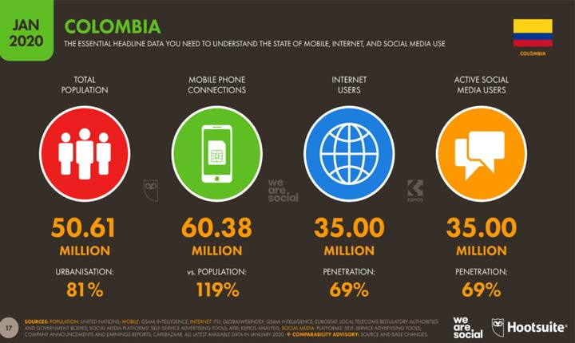

# Actividad evaluativa de primer corte

## Origen de la información

La base de datos utilizada en este informe, se ha obtenido desde la página de **datos abiertos de Colombia**, disponible desde el siguiente enlace: <https://www.datos.gov.co/Ciencia-Tecnolog-a-e-Innovaci-n/Internet-Fijo-Penetraci-n-Municipio/fut2-keu8>


La base de datos, cuenta con informacion sobre el "*Número de suscriptores con acceso dedicado a Internet para cada uno de los departamentos y municipios de Colombia, según los datos reportados por los proveedores al último día de cada trimestre.*" **(Datos abiertos, 2021)**

Los objetivos al analizar esta base de datos son los siguientes:

-   Alcance del internet en los municipios
-   Comparar el acceso a internet entre los departamentos
-   Evidenciar la desigualdad del pais en temas de acceso a las TICs

Las variables principales de la base de datos son:

-   Indice
-   Año
-   Trimestre
-   Departamento
-   Municipio
-   No de acceso fijo a internet
-   Población DANE



## Limpieza y preprocesamiento

Inicialmente se importó la base de datos y se visualizó para conocer sus características y las limpiezas necesarias:

```{r}
setwd("/home/retray/R/DataBasesAnalysis")
```

```{r}
internetColombia = read.csv("Internet_Fijo_Penetraci_n_Municipio.csv")
internetColombia
```

Despues de realizar el proceso anterior, se importaron las principales librerías de procesamiento para obtener datos tidy:

```{r}
library(tidyverse)
library(dplyr)
library(knitr)
```

Finalmente, resultan necesarias las siguientes correcciones:

-   Se hace evidente que los nombres de las columnas no resultan totalmente claros, por lo tanto se implementa el requerimiento de renombrar nombres de columnas

```{r}
names(internetColombia) = c("Año", "Trimestre", "Departamento", "Municipio", "NumeroDeAccesosAInternet","PoblacionDANE", "Indice")
View(internetColombia)
```

## Análisis descriptivo

```{r}
datosCuant = internetColombia[,c(5,7)]
as.numeric(datosCuant$Indice)
View(datosCuant)

promedio = apply(datosCuant, 2, mean)
mediana = apply(internetColombia, 2, median)
minimo = apply(internetColombia, 2, min)
maximo = apply(internetColombia, 2, max)
rangeFunction = function(x) max(x)-min(x)
rango = apply(internetColombia, 2, rangeFunction)
varianza = apply(internetColombia, 2, var)
desviacion = apply(internetColombia, 2, sd)

resultadosApply = cbind(round(promedio,2),round(mediana,2),round(minimo,2),round(maximo,2),round(rango,2),round(varianza,2),round(desviacion,2))
resultadosApply
```

## Conclusiones

R resulta ser una herramienta muy util para el manejo de datos y su sencilla forma de filtrar y crear datos de analisis. Por otro lado, el lenguaje es facil de usar y aprender. Las tablas creadas son faciles de leer y existen multiples funciones para su creacion, analisis y ordenamiento. Actualmente, en Colombia existe mucha desigualdad y falta de acceso para todas las regiones a internet, un recurso tremendamente valioso, especialmente en tiempos de cuarentena y virtualidad.
