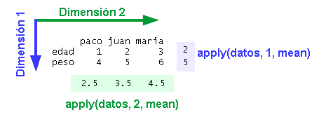
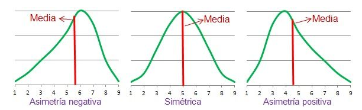
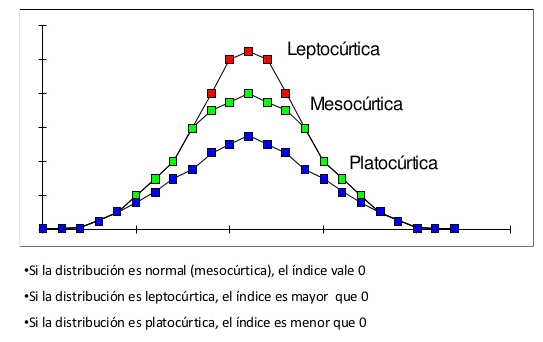

```{r}
#Definir el entorno de trabajo
setwd("/home/retray/R/DataBasesAnalysis")
```

```{r}
#Cargar la base de datos (clase anterior)
Data = read.csv("/home/retray/R/DataBasesAnalysis/Base.txt", sep="")
```

# Análisis descriptivo - Parte 1.

## Resumen descriptivo de los datos depurados.

Vamos a calcular las medidas de localización, pocisión y variabilidad para los datos que hemos depurado.

### Variables cuantitativas.

Calcular promedio, mediana, minímo, máximo, rango, varianza, desviación y coeficiente de variación para la variable Years

```{r}
y = Data$Years
#Promedio
m = mean(y)
m

#Mediana
me = median(y)
me

#Minímo
min = min(y)
min

#Máximo
max = max(y)
max

#Rango
range = max - min
range

#Varianza
var = var(y)
var

#Desviación
des = sd(y)
des

#Coeficiente de variación
cv = (des/m)*100

valor = round(c(m, me, min, max, range, var, des, cv))
medidas = c("Media", "Mediana", "Minimo", "Maximo", "Rango", "Variacion", "Desviacion", "Coeficiente de variacion")

resultados = data.frame(cbind(medidas, valor))
resultados

```

#### Ejercicio: Calcular la medidas de localización y dispersión para la variable edad

```{r}
edadData = Data$Age
edadData

media = mean(edadData)
media

mediana = median(edadData)
mediana

valores = round(c(media, mediana))
medida = c("Promedio", "Mediana")
tabla = data.frame(cbind(medida, valores))
tabla
```

### Variables cualitativas,

Calcular conteos por categoría para la variable genéro.

```{r}
table(Data$Sex)
```

#### Ejercicio: Calcular los conteos por categoría para la variable Sport y City

```{r}
table(Data$Sport)

table(Data$City)
```

**¿Qué pasa si queremos calcular todas la medidas al tiempo? o ¿Si queremos medidas por grupo?**

# La familia apply

La idea de las funciones que pertenecen a esta familia es la manipulación de vectores, matrices, listas y data frame. Permiten evitar el uso directo de ciclos por medio de funciones que operan directamente sobre cada elemento de la estructura de datos.

## apply()

Esta función es aplicable sobre matrices, su estructura es apply(x, MARGIN, FUN, ...) y sus parámetros son los siguientes:

x es la matriz de datos. MARGIN indica que podemos realizar operaciones sobre filas o columnas donde 1 indica filas y 2 indica columnas. FUN ss la función que se quiere aplicar sobre los datos, esta puede ser una función de agregación, una de transformación o subconjunto o funciones vectorizadas.



Podemos utilizar la función apply para calcular las medidas resumen de todas la variables cuantitativas y presentar la información en una sola tabla.

```{r}
#Construya una base solo con las variables cuantitativas
Data1 = Data[,c(3:5,7:9)]
Data1

#Construya un vector con los nombres de las variables cuantitativas.
Ncuant = c("Years", "Cig", "PC", "Weight", "Age", "Height")
colnames(Data1) = Ncuant
View(Data1)

# Definir el código para calcular el promedio
f1 = apply(Data1, 2, mean)

# Definir el código para calcular la mediana
f2 = apply(Data1, 2, median)

# Definir el código para calcular el mínimo
f3 = apply(Data1, 2, min)

# Definir el código para calcular el máximo
f4 = apply(Data1, 2, max)

# Definir el código para calcular el rango
rangeFunction = function(x) max(x)-min(x)
f5 = apply(Data1, 2, rangeFunction)

# Definir el código para calcular la varianza
f6 = apply(Data1, 2, var)

# Definir el código para calcular la desviación
f7 = apply(Data1, 2, sd)

# Definir el código para calcular el coeficiente de variación
variationCoeficient = function(x) sd(x)/mean(x)
f8 = apply(Data1, 2, variationCoeficient)

#Organizar toda la información en una tabla de resultados y redondear a dos cifras decimales.

resultadosApply = cbind(round(f1,2),round(f2,2),round(f3,2),round(f4,2),round(f5,2),round(f6,2),round(f7,2),round(f8,2))
resultadosApply

#Presentar resultados por columnas

rownames(resultadosApply) = c("Name col1", "Other name col2")


#Presentar resultados por filas

resultadosApply = rbind(round(f1,2),round(f2,2),round(f3,2),round(f4,2),round(f5,2),round(f6,2),round(f7,2),round(f8,2))
resultadosApply

```

## tapply()

Esta función permite aplicar funciones a subconjuntos de datos de un data frame o vector. Su estructura esta dada por tapply(X, INDEX, FUN , ..., simplify = TRUE).

```{r}
#Calcular la media de PC agrupoando por Sport

```

```{r}
#Calcular la media de PC agrupoando por Sport

```

#### Ejercicio: Calcular el número de cigarrillos promedio por género. En promedio ¿Quiénes fuman más?

```{r}
tapply(Data$Cig,Data$Sex,mean)

```

#### Ejercicio: Calcular la media y el coeficiente de variación para el peso y la estutura de hombres y mujeres. ¿Cuál es la media para cada grupo y que datos son más variables? Presente la información organizada en una tabla donde las columnas sean el genero y la filas sean las medidas resumen indicadas. Tambien calcule la media y el coeficiente de variación para peso y estatura sin agrupar y compare con los resultados agrupados ¿Hay diferencias?

## Nota: hay otras funciones de la familia apply: lapply(), sapply(), mapply() y vapply(). Consultar

# Medidas resumen adicionales

Las medidas de posición y de forma permiten identificar la manera en que se distribuyen los datos.

### Cuantiles

```{r}
# Determinar los cuantiles para la variable Age

t1 <- tapply(Data$Weight,Data$Sex,mean)
t2 <- tapply(Data$Weight,Data$Sex,variationCoeficient)
t3 <- tapply(Data$Height,Data$Sex,mean)
t4 <- tapply(Data$Height,Data$Sex,variationCoeficient)
Tabla1 <- rbind(t1,t3,t2,t4)
rownames(Tabla1) <- c("Peso promedio","Estatura promedio","Coef.V peso","Coef.V estatura")
Tabla1 
apply(Data[,c(7,9)], 2, mean)
apply(Data[,c(7,9)], 2, variationCoeficient)

quantile(Data$Age)

```

### Asimetría.



```{r}
# Determinar la asimetría para la variable Age
install.packages("moments")
library(moments)
skewness(Data$Age)
hist(Data$Age)
```

### Curtosis



```{r}

```
